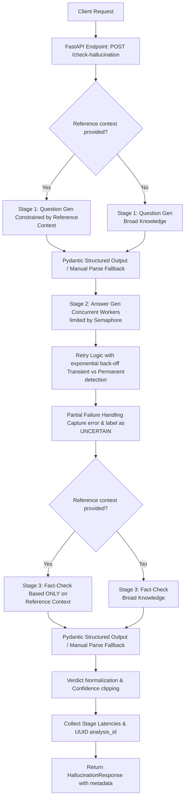

# LLM Hallucination Tester 🔬

I built this over a weekend because I was tired of LLMs confidently stating absolute nonsense as fact. When building RAG pipelines, you want some way to benchmark how often a model just makes stuff up. This tool generates a bunch of factual questions about a topic, gets the model to answer them, and then uses a separate, clean LLM instance to check the answers and score the accuracy.

It also comes with a nice little dark-mode dashboard so you don't have to keep reading raw JSON in the terminal.

---

## Architecture & How It Works

The application orchestrates an upgraded 3-stage pipeline using FastAPI, LangChain, and Pydantic:



### Upgraded Enterprise Features
1. **Optional Reference-Based Verification**: Pass a `reference` text string. The pipeline will constrain question generation and fact-checking to only use the reference context rather than the LLM's generic knowledge base.
2. **Structured Outputs & Fallbacks**: Utilizes LangChain's `.with_structured_output` with custom Pydantic schemas. If a model fails to return structured output, it falls back to regex and manual JSON parsing.
3. **Concurrency Control**: A semaphore (`asyncio.Semaphore`) restricts active concurrent requests to prevent triggering rate-limit blocks (configurable via `MAX_CONCURRENCY`).
4. **Transient Error Retries**: Uses `tenacity` with exponential back-off to retry transient errors (network timeouts, rate limits, 5xx server errors) while failing fast on permanent errors (auth failures, 400 Bad Requests).
5. **Partial Failure Resilience**: Individual stage errors are isolated. If an answer fails to generate, it is marked as `UNCERTAIN` instead of crashing the entire batch of questions.
6. **Detailed Observability**: Outputs timing latency (in milliseconds) for each pipeline stage, a unique `analysis_id` (UUIDv4) for tracking, UTC ISO timestamp, and a structured `evaluation_summary` containing rate metrics.

---

## Tech Stack

* **Backend:** Python, FastAPI, LangChain (`langchain-openai`)
* **Frontend:** HTML & CSS (served directly by FastAPI at `/`)
* **Deployment:** Docker, GCP Cloud Run configuration
* **Testing:** Pytest / Unittest with comprehensive mock coverage

---

## Setup & Running Locally

### Prerequisites

* Python 3.11+
* An OpenAI API key

### 1. Local Setup

First, clone this thing and go into the folder:

```bash
git clone https://github.com/aayeraahmad531/llm-hallucination-tester.git
cd llm-hallucination-tester
```

Create a virtual env and activate it:

```bash
python -m venv .venv

# On Windows:
.venv\Scripts\activate

# On Mac/Linux:
source .venv/bin/activate
```

Install the dependencies:

```bash
pip install -r requirements.txt
```

### 2. Configure Environment

Copy the example file to `.env`:

```bash
cp .env.example .env
```

Open `.env` and set the following parameters:
* `OPENAI_API_KEY`: Your OpenAI API Key
* `MAX_QUESTIONS`: Server-side cap for questions (default: `10`)
* `MAX_CONCURRENCY`: Semaphore limit for concurrent LLM requests (default: `3`)
* `MAX_RETRIES`: Maximum retry attempts for transient errors (default: `3`)
* `LLM_TIMEOUT`: Timeout in seconds for LLM calls (default: `30.0`)
* `ALLOWED_ORIGINS`: Allowed CORS origins comma-separated (default: `*`)

### 3. Run the Server

Start it up with uvicorn:

```bash
uvicorn app.main:app --host 127.0.0.1 --port 8080 --reload
```

Now open **http://localhost:8080** in your browser to use the dashboard!
If you just want the raw API Swagger docs, they are at **http://localhost:8080/docs**.

---

## Running with Docker

If you don't want to deal with Python environments, just build the Docker image:

```bash
# Build it
docker build -t hallucination-tester .

# Run it (makes sure it reads your local .env file)
docker run -p 8080:8080 --env-file .env -e PORT=8080 hallucination-tester
```

---

## API Quick Reference

If you want to query it programmatically instead of using the UI:

### `POST /check-hallucination`

**Request with Reference:**
```json
{
  "topic": "Discovery of Radium",
  "num_questions": 2,
  "model": "gpt-4o-mini",
  "reference": "Marie and Pierre Curie announced their discovery of radium on December 26, 1898, to the French Academy of Sciences."
}
```

**Response Summary:**
```json
{
  "topic": "Discovery of Radium",
  "questions_tested": 2,
  "hallucination_rate": 0.0,
  "results": [
    {
      "question": "When did Marie and Pierre Curie announce their discovery of radium?",
      "answer": "They announced the discovery on December 26, 1898.",
      "verdict": "ACCURATE",
      "confidence": 1.0,
      "reasoning": "Fully matches the reference text which states they announced the discovery on December 26, 1898.",
      "llm_judge_verdict": "ACCURATE"
    }
  ],
  "summary": "Tested 2 questions about 'Discovery of Radium'. Results: 2 accurate, 0 hallucinated, 0 uncertain. Hallucination rate: 0%.",
  "analysis_id": "a1b2c3d4-e5f6-7a8b-9c0d-1e2f3a4b5c6d",
  "timestamp": "2026-08-15T09:30:00Z",
  "model_used": "gpt-4o-mini",
  "evaluation_mode": "REFERENCE_BASED",
  "question_generation_latency_ms": 105.2,
  "answer_generation_latency_ms": 250.6,
  "fact_check_latency_ms": 120.4,
  "total_latency_ms": 476.2,
  "evaluation_summary": {
    "accurate_count": 2,
    "hallucinated_count": 0,
    "uncertain_count": 0,
    "hallucination_rate": 0.0,
    "summary_text": "Tested 2 questions about 'Discovery of Radium'. Results: 2 accurate, 0 hallucinated, 0 uncertain. Hallucination rate: 0%."
  },
  "disclaimer": "This tool provides automated LLM-based factuality assessments and should not be treated as definitive ground truth. Results may contain errors and should be independently verified for high-stakes use."
}
```

---

## Known Limitations & Future Plans

* **Self-Grading Bias:** By default, the same model configuration evaluates its own answers, which can introduce evaluation bias. For production use, it is recommended to evaluate smaller models (like `gpt-4o-mini`) using a more capable model (like `gpt-4o`) as the judge.
* **Manual Context Ingestion:** The reference context must be supplied as a raw text string in the API payload. There is currently no support for document uploads (PDF/TXT) or direct RAG vector store integration.
* **Anthropic/Gemini Support:** Currently, the system is designed around OpenAI model endpoints. Future iterations will support Claude and Gemini for cross-provider hallucination benchmarks.
* **Cost:** Because the pipeline performs fact-checking calls per generated question, testing large batches of questions on premium models can accumulate significant API costs.

---

## Responsible AI Disclaimer

> [!IMPORTANT]
> **This tool provides automated LLM-based factuality assessments and should not be treated as definitive ground truth. Results may contain errors and should be independently verified for high-stakes use.**

